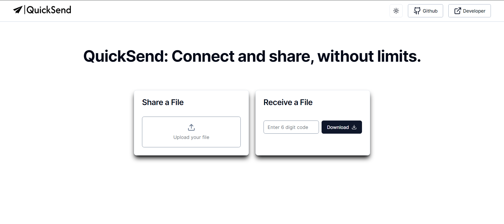
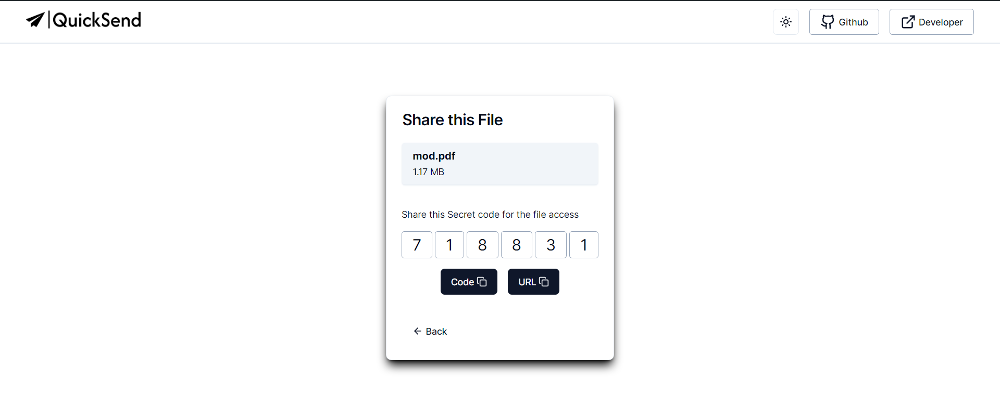

### 🎉 Welcome! Need to share files in a flash? You're in the right place. Our website makes it easy, fast, and simple – no lengthy authentication or login required. Just upload and share. It's that easy! 💨

## 🚀 Getting Started

### **Clean and Simple Home Page**

- QuickSend's home page is straightforward, making it easy for users to navigate and share files effortlessly.

### **Select File to Upload**

- Choose the file you wish to upload with QuickSend's straightforward interface.

### **Upload File with realtime Progress**

- QuickSend lets you upload files easily, showing real-time progress as they upload. Stay updated throughout the process for smooth sharing.

### **Complete Upload and Generate Code & URL**

- After uploading, QuickSend generates a unique code and URL for your file. Copy and share them to allow others to access your uploaded content effortlessly

### **Download Access**

- Use the provided code or URL to access and download your file effortlessly, ensuring convenient file retrieval for all users.

## Features

### 📤 **Upload Files**

&nbsp;&nbsp;&nbsp;&nbsp;&nbsp;&nbsp;&nbsp;&nbsp;&nbsp;&nbsp;&nbsp; Users can upload files to share with others.

### 🔒 **Secure Sharing**

&nbsp;&nbsp;&nbsp;&nbsp;&nbsp;&nbsp;&nbsp;&nbsp;&nbsp;&nbsp;&nbsp; Each file upload generates a unique secret code and URL for secure sharing.

### 📥 **Download Files**

&nbsp;&nbsp;&nbsp;&nbsp;&nbsp;&nbsp;&nbsp;&nbsp;&nbsp;&nbsp;&nbsp;Recipients can download files using either the secret code or the URL provided.

### 🖥️ **User-friendly Interface**

&nbsp;&nbsp;&nbsp;&nbsp;&nbsp;&nbsp;&nbsp;&nbsp;&nbsp;&nbsp;&nbsp;Clean and intuitive interface for seamless file sharing experience.

## Advantages

### 🔓 **No Authentication Required**

&nbsp;&nbsp;&nbsp;&nbsp;&nbsp;&nbsp;&nbsp;&nbsp;&nbsp;&nbsp;&nbsp;QuickSend allows users to download files without requiring any authentication, making it convenient for both senders and recipients.

### 🎨 **Beautiful and Simple UI**

&nbsp;&nbsp;&nbsp;&nbsp;&nbsp;&nbsp;&nbsp;&nbsp;&nbsp;&nbsp;&nbsp;QuickSend features a clean and intuitive user interface, making it easy for users to navigate and use the application without any hassle.

### 📱 **Cross-Platform Compatibility**

&nbsp;&nbsp;&nbsp;&nbsp;&nbsp;&nbsp;&nbsp;&nbsp;&nbsp;&nbsp;&nbsp;QuickSend works seamlessly across different devices and platforms, allowing users to access and share files from anywhere, anytime.

### ⏱️ Fast File Sharing

&nbsp;&nbsp;&nbsp;&nbsp;&nbsp;&nbsp;&nbsp;&nbsp;&nbsp;&nbsp;&nbsp;QuickSend makes file sharing quick and easy, helping users share and recieve files faster.

## Connect With Me

## Technologies Used

